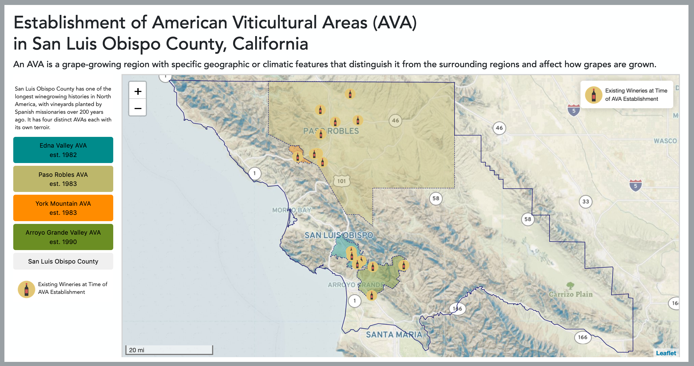

# portfolio

### Existing Wineries at American Viticultural Area Establishment

<https://aimeeavant.github.io/portfolio/672_010/AVAmapScreenShot.png>
Interactive Map: []
(https://aimeeavant.github.io/portfolio/672_010/ "Existing Wineries at American Viticultural Area Establishment")

[(https://aimeeavant.github.io/portfolio/672_010/)

### Boundaries of American Viticultural Areas

### Cholorpleth Map of US Population Density

### U.S. Natural Gas & Petroleum Power Plants

<https://aimeeavant.github.io/portfolio/672_07>

### Regional Map

#### 671 Classwork

Lab 03 : [Major Waterways of California](https://aimeeavant.github.io/portfolio/671_03/index.html "Lab 03 : Major Waterways of California")

Lab 04 : [Cholorpleth Map of US Population Density](https://aimeeavant.github.io/portfolio/671_04/index.html "Lab 04 : Cholorpleth Map of US Population Density")

Lab 05 : [Breweries in North America and Hawaii](https://aimeeavant.github.io/portfolio/671_05/index.html "Lab 05 : Breweries in North America and Hawaii")

Lab 06 : [Pacific Crest Trail Map](https://aimeeavant.github.io/portfolio/671_06/index.html "Lab 06 : Pacific Crest Trail Map")

Lab 07 : [San Luis Obispo County Parks](https://aimeeavant.github.io/portfolio/671_07/index.html "Lab 07 : San Luis Obispo County Parks")

Lab 09 : [Chimney Rock Pilar](https://aimeeavant.github.io/portfolio/671_09/index.html "Lab 09 : Chimney Rock Pilar")

Lab 10 : [Boundaries of American Viticultural Areas](https://aimeeavant.github.io/portfolio/671_010/index.html "Lab 10 : Boundaries of American Viticultural Areas")

#### 672 Classwork

Lab 01 : [Edinburgh, Scotland](https://aimeeavant.github.io/portfolio/672_01/index.html "Lab 01 : Edinburgh, Scotland")

Lab 02 : [Kentucky Cities](https://aimeeavant.github.io/portfolio/672_02/index.html "Lab 02 : Kentucky Cities")

Lab 03 : [Webcam Stations](https://aimeeavant.github.io/portfolio/672_03/index.html "Lab 03 : Webcam Stations")

Lab 04a : [Calculating Density Measures on the Fly](https://aimeeavant.github.io/portfolio/672_04a/index.html "Lab 04 : Calculating Density Measures on the Fly")

Lab 04b : [Webcam Stations with Custom Markers](https://aimeeavant.github.io/portfolio/672_04b/index.html "Lab 04 : Webcam Stations with Custom Markers")

Lab 05 : [Places of Interest in New Orleans](https://aimeeavant.github.io/portfolio/672_05/index.html "Lab 05 : Places of Interest in New Orleans")

Lab 06 : [Route Mapping](https://aimeeavant.github.io/portfolio/672_06/index.html "Lab 06 : Route Mapping")

Lab 07 : [U.S. Natural Gas & Petroleum Power Plants](https://aimeeavant.github.io/portfolio/672_07/index.html "Lab 07 : U.S. Natural Gas & Petroleum Power Plants")

Lab 08 : [Interactive Mapping with Multiple Layers](https://aimeeavant.github.io/portfolio/672_08/index.html "Lab 08 : Interactive Mapping with Multiple Layers")

Lab 09 : [US Median Rent](https://aimeeavant.github.io/portfolio/672_09/index.html "Lab 09 : US Median Rent")

Lab 10 : [Existing Wineries at American Viticultural Area Establishment](https://aimeeavant.github.io/portfolio/672_010/index.html "Lab 10 : Existing Wineries at American Viticultural Area Establishment")